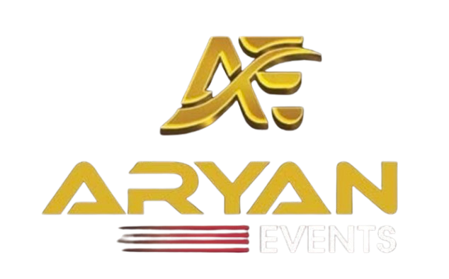

# Aryan Events - Premium Event Management



A modern, responsive website for Aryan Events - a premium event management company based in Kottarakara, Kerala, India. We specialize in creating unforgettable moments for weddings, corporate events, and special celebrations.

## 🌟 Features

- **Modern & Responsive Design** - Fully responsive across all devices (desktop, tablet, mobile)
- **Interactive Video Portfolio** - Showcase event highlights with hover-to-play videos in 9:16 aspect ratio
- **Smooth Animations** - Engaging animations and transitions throughout the site
- **Service Showcase** - Comprehensive display of event management services
- **Client Testimonials** - Social proof section for customer reviews
- **Contact Integration** - Easy contact form and WhatsApp integration
- **SEO Optimized** - Meta tags and structured data for better search visibility

## 🚀 Tech Stack

- **Frontend Framework:** React 18.3.1
- **Build Tool:** Vite 5.4.19
- **Language:** TypeScript 5.8.3
- **Styling:** Tailwind CSS 3.4.17
- **UI Components:** shadcn/ui + Radix UI primitives
- **Icons:** Lucide React
- **Routing:** React Router DOM 6.30.1
- **State Management:** @tanstack/react-query 5.83.0
- **Form Handling:** React Hook Form + Zod validation
- **Animations:** Custom CSS animations with Tailwind

## 📋 Prerequisites

Before you begin, ensure you have the following installed:
- **Node.js** (v18 or higher) - [Download](https://nodejs.org/)
- **npm** or **bun** package manager

## 🛠️ Installation & Setup

### 1. Clone the repository

```bash
git clone https://github.com/salahudheenthajudheen/aryan-events.git
cd aryan-events
```

### 2. Install dependencies

Using npm:
```bash
npm install
```

Or using bun:
```bash
bun install
```

### 3. Start the development server

```bash
npm run dev
```

The application will be available at `http://localhost:8080`

## 📦 Available Scripts

- **`npm run dev`** - Start development server on port 8080
- **`npm run build`** - Build for production
- **`npm run build:dev`** - Build in development mode
- **`npm run preview`** - Preview production build locally
- **`npm run lint`** - Run ESLint for code quality checks

## 🏗️ Project Structure

```
aryan-events-main/
├── public/              # Static assets
├── src/
│   ├── assets/         # Images, videos, and media files
│   ├── components/     # React components
│   │   ├── ui/        # Reusable UI components (shadcn)
│   │   ├── About.tsx
│   │   ├── Contact.tsx
│   │   ├── Footer.tsx
│   │   ├── Gallery.tsx
│   │   ├── Hero.tsx
│   │   ├── Navigation.tsx
│   │   ├── Services.tsx
│   │   ├── Testimonials.tsx
│   │   └── WhatsAppButton.tsx
│   ├── hooks/         # Custom React hooks
│   ├── lib/           # Utility functions
│   ├── pages/         # Page components
│   │   ├── Index.tsx
│   │   └── NotFound.tsx
│   ├── App.tsx        # Main App component
│   ├── main.tsx       # Application entry point
│   └── index.css      # Global styles
├── index.html
├── package.json
├── tsconfig.json
├── tailwind.config.ts
└── vite.config.ts
```

## 🎨 Key Components

### Navigation
- Fixed navigation bar with logo
- Smooth scroll-to-section functionality
- Responsive mobile menu
- "Get Quote" CTA button

### Hero Section
- Eye-catching hero with background image
- Animated tagline and headlines
- Call-to-action buttons
- Statistics display (500+ events, 15+ years, 100% satisfaction)

### Services
- Comprehensive service showcase
- Decorations, sound & light, photography, catering, etc.

### Gallery/Portfolio
- Video portfolio in 9:16 aspect ratio
- Hover-to-play functionality
- Automatic loop and reset on mouse leave

### Contact
- Contact form with validation
- Contact information display
- WhatsApp integration button

## 🎯 Services Offered

1. **Marriage Functions** - Complete wedding planning and execution
2. **Stage Decorations** - Creative and elegant stage setups
3. **Sound & Light** - Professional audio-visual services
4. **Photography & Videography** - Professional event coverage
5. **Catering Services** - Delicious food arrangements
6. **Entertainment** - DJ, live music, and performances

## 🌐 Deployment

### Building for Production

```bash
npm run build
```

The build output will be in the `dist/` directory.

### Deploy to Vercel, Netlify, or similar platforms

1. Connect your GitHub repository
2. Set build command: `npm run build`
3. Set output directory: `dist`
4. Deploy!

## 🔧 Configuration

### TypeScript Configuration
- Path aliases configured (`@/*` → `./src/*`)
- Strict mode disabled for flexibility
- Modern ES2020 target

### Tailwind Configuration
- Custom color scheme (brand-gold, brand-red)
- Custom animations (fade-in, scale-in, float)
- Custom shadows and gradients
- Typography plugin included

## 📱 Responsive Breakpoints

- **Mobile:** < 768px
- **Tablet:** 768px - 1024px
- **Desktop:** > 1024px

## 🐛 Known Issues & Notes

- TypeScript strict mode is disabled; consider enabling gradually
- No test suite configured yet
- 2 moderate npm audit vulnerabilities (run `npm audit fix`)

## 📄 License

This project is proprietary and confidential.

## 👥 Contact

**Aryan Events**
- Location: Kadamkulam, Kottarakara, Kerala, India
- Website: [Your Website URL]
- Email: [Your Email]
- Phone: [Your Phone Number]

## 🤝 Contributing

This is a private project for Aryan Events. For any changes or suggestions, please contact the repository owner.

---

Built with ❤️ by Aryan Events Team
